# [DoodleOps](https://doodleops.com)


*Modular SaaS Platform & Starter Kit – maintained by [Alexandru Girlea](https://github.com/AlexandruGirlea)*

One‑person project supporting NGOs and individual learners.

If you would like to connect, you can do so via [LinkedIn](https://www.linkedin.com/in/alexandru-girlea/) or email: [alex@doodleops.com](mailto:alex@doodleops.com).

---

## ✨ Why choose DoodleOps

* **Complete SaaS backbone:** OAuth.2, SSO, username + password, API‑key auth, full Stripe billing, admin dashboard.  
* **GenAI‑ready:** ChatGPT plugin integration, WhatsApp bot demo powered by LangGraph.  
* **Cloud‑agnostic:** containerised; runs today on Google Cloud and deploys the same to AWS, Azure or on‑prem.  
* **Infrastructure‑as‑Code:** Terraform modules and Cloud.Build CI/CD pipelines included. 
* **Live demo:** <https://doodleops.com>
---

## 💼 Licensing at a glance
*Full terms:* see [**LICENSE**](LICENSE.md) (BSL 1.1) and [**COMMERCIAL_LICENSE.md**](COMMERCIAL_LICENSE.md).

| Audience             | Rights                                          | Cost                                                             |
|----------------------|-------------------------------------------------|------------------------------------------------------------------|
| Learners & hobbyists | Non‑production use (≤ 25 users)                 | **Free**                                                         |
| Recognised NGOs      | Full production use (logo attribution required) | **Free**                                                         |
| Start-ups            | Production use                                  | Revenue-share **or** fixed OEM plan — see Commercial License     |
| Businesses           | Production use                                  | One-time licence tiers (Training → OEM) — see Commercial License |


---

## 🤝 Community & support

* Private **Slack** for licensees and NGOs (1 named contact for Training/Growth, 3 for Enterprise, 5 for OEM; **max 5 support tickets per month**; response 2‑3 business days).  
* Feature requests & bug reports: open a GitHub issue **or** email [alex@doodleops.com](mailto:alex@doodleops.com).  
* If this repo helps you in your learning journey, please consider **starring** it on GitHub to show your support!

---

## 🛠️ Project structure

***Production Network Topology***


***How Users Connect to DoodleOps***

```mermaid
flowchart TD
    user[User / Client]

    subgraph Entry_Points
        WebUI["Web UI<br>🔒 Google SSO / Password"]
        APIKey["Custom API Endpoint<br>🔑 API Key"]
        WhatsApp["WhatsApp Bot<br>🔒 Twilio Auth"]
        ChatGPT["ChatGPT Plugin (DoodleOps PDF)<br>🔒 OAuth"]
    end

    subgraph Core
        DOps[DoodleOps Core Services]
    end

    user --> WebUI
    user --> APIKey
    user --> WhatsApp
    user --> ChatGPT

    WebUI --> DOps
    APIKey --> DOps
    WhatsApp --> DOps
    ChatGPT --> DOps
```


***Example Stripe Billing Flow***

```mermaid
%%{init: {'flowchart': {'title': 'Stripe Billing Options for DoodleOps'}}}%%
flowchart TB
    direction LR

    U["User<br/>Checkout<br/>(Stripe)"]

    U --> A1[[One-Time<br/>Credit Packs]]
    U --> B1[[Subscriptions]]
    U --> C1[[Enterprise<br/>Pay-as-You-Go]]

    %% ───────── Credit Packs ─────────
    subgraph "Credit Packs (expire after X days)"
        A2["$5 ⇒ 400 credits"]
        A3["$10 ⇒ 1 000 credits"]
        A4["$20 ⇒ 2 200 credits"]
    end
    A1 --> A2 & A3 & A4

    %% ───────── Subscriptions ─────────
    subgraph "Base & Pro Tiers"
        direction TB
        B2["Base<br/>550 credits / mo"]
        B3["Pro<br/>1 100 credits / mo"]
        class B2 tierBase
        class B3 tierPro
    end
    B1 --> B2 & B3

    Bnote["Monthly or yearly billing<br/>Unused credits roll over<br/>until subscription ends"]
    B1 --> Bnote

    %% ───────── Enterprise ─────────
    subgraph "Metered Billing"
        C2["Cost = credits_used × $0.01<br/>+ flat $20 / month"]
        class C2 tierEnt
    end
    C1 --> C2

    %% Styles
    classDef note     fill:#ffffff,stroke-dasharray:3 3,color:#6b7280,font-style:italic;
    class Bnote note
```

***WhatsApp → LangGraph Hierarchical Agents Workflow***


## 👐 Contributing
* **Contributions welcome!** By submitting code you agree to the DoodleOps CLA
  – see [CONTRIBUTING.md](CONTRIBUTING.md) for the legal details.

## 🏠 How to run the project locally
1. **Clone the repository:**
```bash
git clone git@github.com:AlexandruGirlea/doodleops-public.git
cd doodleops-public
```

2. **Install dependencies:**

Make sure you have `Make, Docker, Docker Compose and Python` installed.

3. **Setup the environment secrets**
```bash
cp deploy/local/app_web/demo.env deploy/local/app_web/.env
cp deploy/local/app_api/demo.env deploy/local/app_api/.env
cp deploy/local/app_api/app_ai_v1/demo.env deploy/local/app_api/app_ai_v1/.env
```


4. **Build/Start your containers and run the servers**
```bash
# for example
make build cont=api
make up cont=api
make run cont=api

make build cont=web
make up cont=web
make run cont=web

make build cont=app_pdf_v1
make up cont=app_pdf_v1
make run cont=app_pdf_v1
```

For more helpful make commands, run `make help`.

OBS: to fully make the project run locally you need to setup SSO through Firebbase,
setup Stripe and other referenced services in the `.env` files.


© 2025 Alexandru Girlea.