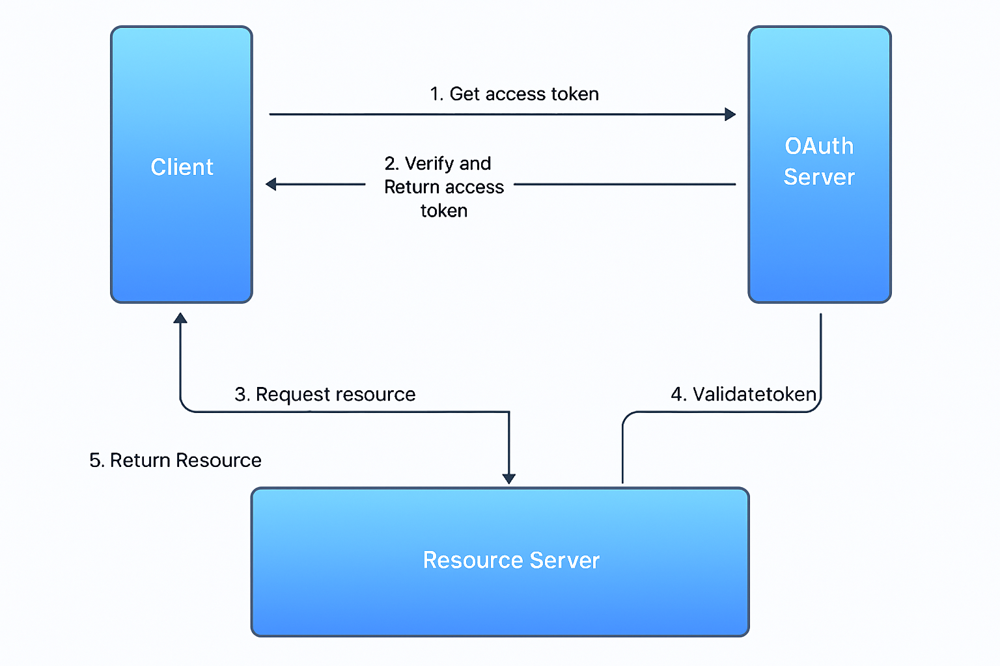

# How Authentication works in App API

JWT = Header.Payload.Signature



HEADER:ALGORITHM & TOKEN TYPE:
```json
{
  "alg": "RS256",
  "kid": "b2dff78a0bdd5a02212063499d77ef4deed1f65b",
  "typ": "JWT"
}
```

PAYLOAD:DATA:
```json
{
  "iss": "https://securetoken.google.com/doodleops-dev",
  "aud": "doodleops-dev",
  "auth_time": 1690346998,
  "user_id": "Mxx1zY5MINXw3sNDooQ4oiH2jyg1",
  "sub": "Mxx1zY5MINXw3sNDooQ4oiH2jyg1",
  "iat": 1690346998,
  "exp": 1690350598,
  "email": "test@doodleops.com",
  "email_verified": false,
  "firebase": {
    "identities": {
      "email": [
        "test@doodleops.com"
      ]
    },
    "sign_in_provider": "password"
  }
}
```

### Header (Algorithm & Token Type):
1. alg (Algorithm):
- This specifies the cryptographic algorithm used to sign the JWT.
- In this case, RS256 indicates that the JWT is signed using RSA with SHA-256, 
  which is an asymmetric algorithm. This means the JWT is signed with a private 
  key, and it can be verified by anyone who has the corresponding public key.

2. kid (Key ID):
- This is an identifier for the key used to sign the JWT.
- When JWTs are signed using asymmetric algorithms, the verifier needs to know 
  which public key to use for verification (especially when there are multiple 
  keys, like in key rotation scenarios). The kid is used to hint to the verifier 
  which key was used, so the verifier can then retrieve the corresponding public 
  key (often from a JWKS endpoint) and use it to verify the JWT's signature.
- In this case, the value b2dff78a0bdd5a02212063499d77ef4deed1f65b is the 
  identifier of the key.

3. typ (Type):
- This indicates the type of token.
- Here, JWT indicates that this token is a JSON Web Token. This field can help 
  parsers distinguish between different types of tokens.

### Payload:
1. iss (Issuer):
- This identifies the issuer of the JWT.
- In this case, it's https://securetoken.google.com/doodleops-dev, which indicates
  that the JWT was issued by Firebase for the doodleops-dev project.

2. aud (Audience):
- Identifies the audience that the JWT is intended for.
- It's typically the ID of your Firebase project.

3. auth_time:
- Indicates the time at which the user was authenticated.
- It's a Unix timestamp representing the number of seconds since 
  1970-01-01T00:00:00Z.

4. user_id:
- The unique ID of the authenticated user.
- It's used by Firebase to identify a user across different projects.


5. sub (Subject):
- Identifies the principal entity for whom the JWT is intended.
- In the context of Firebase authentication, it's the same as user_id.

6. iat (Issued At):
- Indicates the time at which the JWT was issued.
- It's a Unix timestamp.

7. exp (Expiration Time):
- Indicates the time after which the JWT must not be accepted for processing.
- Also a Unix timestamp.

8. email:
- The email address associated with the authenticated user.

9. email_verified:
- A boolean indicating whether or not the email address has been verified.
- If true, it means the user has confirmed the email address. Otherwise, they 
  haven't.

10. firebase:
- Contains information specific to Firebase authentication.
- `identities`: - Indicates the various ways in which a user can be identified. - 
  Here, the user is identified by the email address.
- `sign_in_provider`: - Specifies how the user was authenticated. - In this case, 
  it's password, meaning the user authenticated using an email and password 
  combination.
 
**!!! OBS 1: There will be rate limiting implemented at Load Balancer level.**

**!!! OBS 2: Common exception class that does not expose sensitive data to the** 
**user**

**!!! OBS 3: Common logging for all errors, and we should be able to filter by**
**user id**
 
**A. Authenticate and use the api from the Swagger documentation v2:**

Because we can’t have a simple way to customise the swagger documentation, we will
do the following:

1. when a user is logged into Django through the login form, we set also JWT token
cookie (doodleops_token) for the api subdomain so that our Swagger documentation 
can look for that cookie, validate it and allow access to the API endpoints. Use 
these best practices:
- Set your cookies with the HttpOnly
- Set your cookies with the Secure
- Set your cookies with the SameSite
- Only allow high rates of r/s for custom API tokens generated by the user.

2. Behaviour of a locked API endpoint:
- it tries to get the JWT token from the cookie, if not there access is denied;
- it decodes the JWT token with base64 to get the Header and the Payload;
- if it’s the first time (not in cache), it sends it to the Firebase 
  Authentication service for validation;
- it validates the JWT based on the Key ID in the Header of the JWT and by getting
  the key from https://www.googleapis.com/robot/v1/metadata/x509/SA_EMAIL_ADDRESS 
  where the SA_EMAIL_ADDRESS  is the service account for the Firebase service ex: 
  firebase-adminsdk-nkupc@doodleops-dev.iam.gserviceaccount.com
- it then stores it in Cache (ex: Redis for local development of Memorystore for 
  prod GCP). We store the following information: 
- JWT hash  as redis key + expiration based on JWT Payload TTL;
- JWT hash inactivity key with expiration of 1h. If the above key has not been 
  accessed in the last hour we remove it.
- it allows the user to make the request to the protected API endpoints.
 
**B. Authenticate and use the Presentation Website:**

1. The user will create a new user with the help of Firebase auth. The user can 
use either [email + password] or Social login (SSO - “Single Sign-On”).
2. The user will have to validate their email account;
3. The user will use either [email + password] or Social login to login + 2FA, we 
will validate the JWT and create a Django session for the user so that he can 
subscribe, manage subscriptions, view activity log and billing + we will store the
JWT token as a cookie for the api.doodleops.com website.

We will use CSRF tokens in all http forms.
 
**C. Generate JSON Key and use it to make API calls:**
1. The user will login into the Presentation Website;
2. The user will navigate to profile data and to api keys;
3. He will be able to generate an API key (that does not expire), and he can then 
use that key to make all his API calls.
4. The server will know that the key belongs to a specific user and we will bill 
that user based on the API calls he makes.
5. The user should be able to revoke / delete generated API tokens.
6. We will limit the use of this key:
- Tiered Limits: example:
  - Free users: 100 requests/hour
  - Premium users: 1000 requests/hour
  - Enterprise users: 10,000 requests/hour